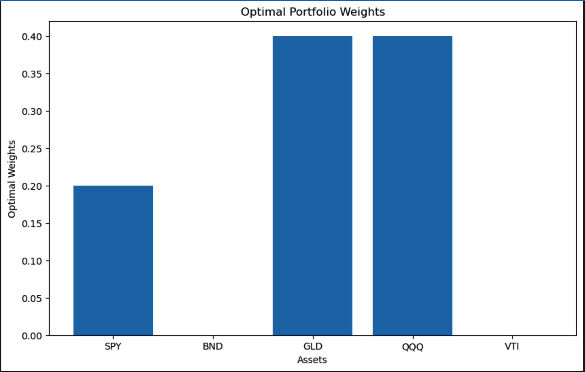

# Portfolio Optimization Project

## Introduction

This project focuses on portfolio optimization, a crucial aspect of financial management aimed at maximizing returns and minimizing risk. By leveraging various optimization techniques, we aim to construct an optimal portfolio of assets.

## Project Structure

The project is organized into the following sections:

1. **Introduction to Portfolio Optimization**:
   - Explanation of the objectives and importance of portfolio optimization.

2. **Data Import and Preparation**:
   - Importing necessary libraries.
   - Loading and cleaning financial data for the assets.

3. **Exploratory Data Analysis (EDA)**:
   - Descriptive statistics and visualization of asset prices and returns.

4. **Portfolio Optimization Methods**:
   - Implementing Mean-Variance Optimization.
   - Risk Parity Optimization.
   - Visualizing the Efficient Frontier.

5. **Results and Analysis**:
   - Optimal portfolio weights.
   - Comparison of different optimization methods.
   - Visualization of results.

6. **Conclusion**:
   - Summary of findings.
   - Future work and potential improvements.

## Getting Started

### Prerequisites

Ensure you have the following libraries installed:

- `pandas`
- `numpy`
- `matplotlib`
- `scipy`

You can install these libraries using pip:

\`\`\`bash
pip install pandas numpy matplotlib scipy
\`\`\`

### Running the Project

1. Clone the repository:
   \`\`\`bash
   git clone https://github.com/sovitnayak123/portfolio-optimization.git
   cd portfolio-optimization
   \`\`\`

2. Open the Jupyter notebook:
   \`\`\`bash
   jupyter notebook Portfolio_Optimization.ipynb
   \`\`\`

3. Follow the instructions within the notebook to execute the cells and reproduce the analysis.

## Results

The project provides insights into optimal portfolio allocation using different optimization techniques. Key findings include:

- Optimal asset weights for different optimization methods.
- Comparison of risk and return profiles.
- Visualization of the Efficient Frontier.

## Conclusion

This project demonstrates the application of portfolio optimization techniques to construct an optimal portfolio of assets. Future work could explore additional optimization methods and incorporate more complex financial models.

## Author

- **Sovit Nayak**

## License

This project is licensed under the MIT License - see the [LICENSE](LICENSE) file for details.

## Acknowledgments

- References and resources used in the project "Youtube"

